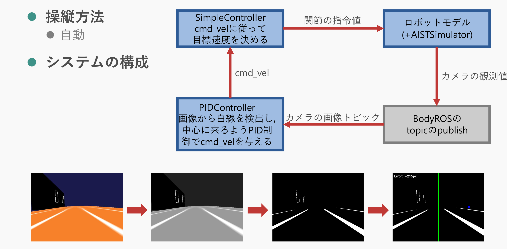

# agent_system_assignment

## システム詳細


## 学習時のプログラム
- `src/genesis_code`に含めている
- 使用した方策は授業で提供していただいた，`model/sub2_com_fric0.2-1.8_kp18-30_kv0.7-1.2_rotI0.01-0.15_iter200`を使用した

## 実行方法
```bash
# roscoreの起動
source ~/agent_system_ws/devel/setup.bash
roscore
```
```bash
# cnoidファイルの実行
source ~/agent_system_ws/devel/setup.bash
rosrun choreonoid_ros choreonoid projects/shorttrack.cnoid
```
```bash
# pid_controllerノードの起動
source ~/agent_system_ws/devel/setup.bash
cd agent_system_ws/src/agent_system_assignment
python3 src/pid_controller.py
```
```bash
# デバッグ用に阿蔵を表示する
# rvizでも良い
rqt_image_view
```

## src/Go2InferenceController.cppを更新したとき
```bash
# buildの実行
cd ~/agent_system_ws
catkin build agent_system_assignment
```
